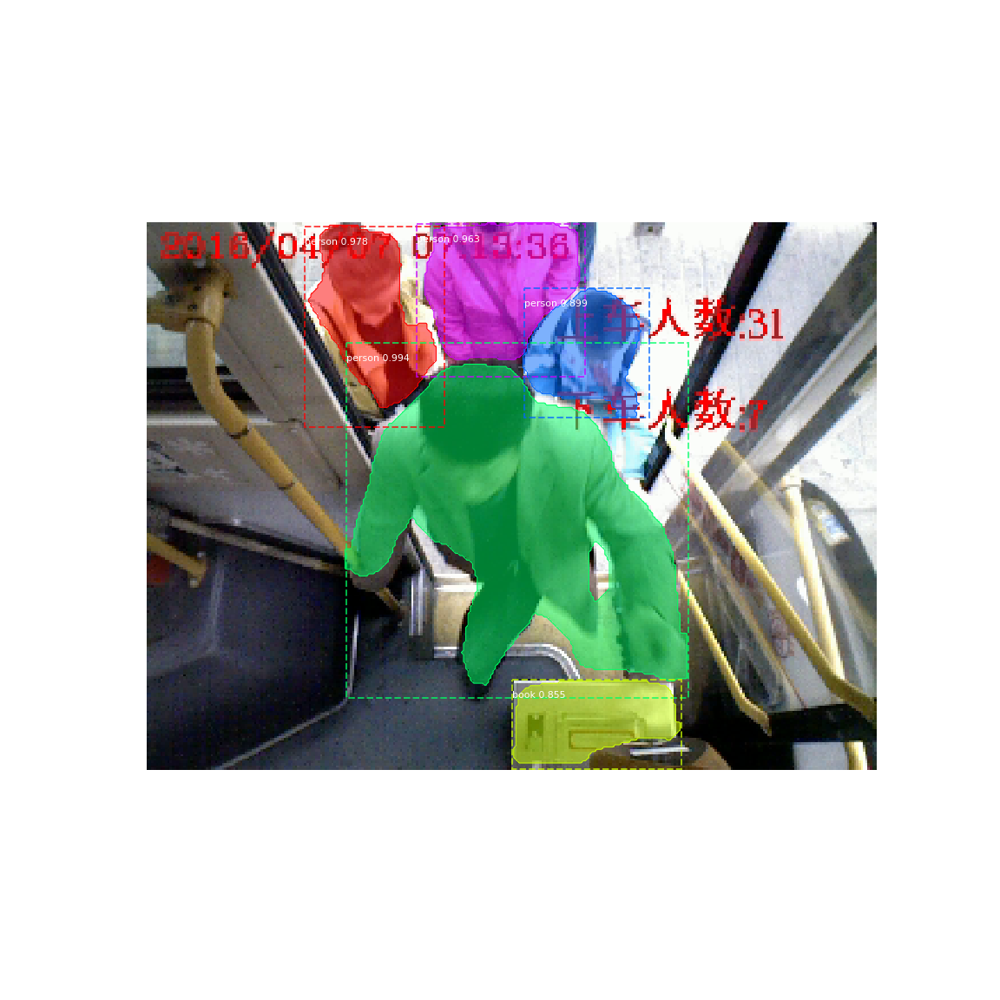
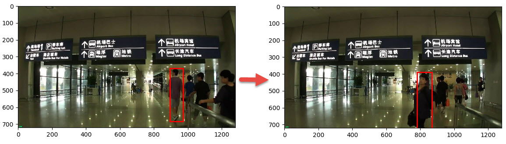

<!-- TOC -->

- [1. CVPR Paper](#1-cvpr-paper)
    - [1.1. All CVPR2018 Paper](#11-all-cvpr2018-paper)
        - [1.1.1. Tracking](#111-tracking)
- [2. Video collection](#2-video-collection)
    - [2.1. Link](#21-link)
    - [2.2. video rank](#22-video-rank)
- [3. Detection](#3-detection)
- [4. Sementation](#4-sementation)
    - [4.1. mask rcnn](#41-mask-rcnn)
- [5. Lip language](#5-lip-language)
    - [5.1. Learning Lip Sync from Audio](#51-learning-lip-sync-from-audio)
- [6. Some Interesting](#6-some-interesting)
    - [6.1. Aging photo prediction](#61-aging-photo-prediction)
    - [6.2. D panorama](#62-d-panorama)
    - [6.3. PanoCatcher](#63-panocatcher)
- [7. Tracking](#7-tracking)
    - [7.1. MOT](#71-mot)
    - [7.2. Correlation Filter](#72-correlation-filter)
    - [7.3. End-to-end representation learning for correlation filter based tracking](#73-end-to-end-representation-learning-for-correlation-filter-based-tracking)
    - [7.4. Attentional Correlation Filter Network for Adaptive Visual Tracking](#74-attentional-correlation-filter-network-for-adaptive-visual-tracking)
    - [7.5. Context-Aware Correlation Filter Tracking](#75-context-aware-correlation-filter-tracking)
- [8. Action Recognition](#8-action-recognition)
- [9. Reconstruction](#9-reconstruction)
- [10. Detection](#10-detection)
- [11. Sementation](#11-sementation)
- [12. Action Recognition](#12-action-recognition)
- [13. Point Cloud Representation](#13-point-cloud-representation)
- [14. Summary](#14-summary)
- [15. Reference](#15-reference)

<!-- /TOC -->

# 1. CVPR Paper
All the paper is available at [official website](http://cvpr2018.thecvf.com/program/main_conference).

The offline list of paper is available at [this](./papers/cvpr2018-paper-list.csv)

## 1.1. All CVPR2018 Paper
### 1.1.1. Tracking

| Paper ID | Type      | Title                                                                                                                                          |
| -------- | --------- | ---------------------------------------------------------------------------------------------------------------------------------------------- |
| 122      | Poster    | [Detect-and-Track: Efficient Pose Estimation in Videos](./papers/1712.09184.pdf)                                                               |
| 255      | Poster    | Multi-Cue Correlation Filters for Robust Visual Tracking                                                                                       |
| 281      | Spotlight | Tracking Multiple Objects Outside the Line of Sight using Speckle Imaging                                                                      |
| 281      | Poster    | Tracking Multiple Objects Outside the Line of Sight using Speckle Imaging                                                                      |
| 369      | Oral      | [Total Capture: A 3D Deformation Model for Tracking Faces, Hands, and Bodies](./papers/1801.01615.pdf)                                         |
| 369      | Poster    | Total Capture: A 3D Deformation Model for Tracking Faces, Hands, and Bodies                                                                    |
| 423      | Spotlight | Fast and Accurate Online Video Object Segmentation via Tracking Parts                                                                          |
| 423      | Poster    | Fast and Accurate Online Video Object Segmentation via Tracking Parts                                                                          |
| 678      | Poster    | [Learning Attentions: Residual Attentional Siamese Network for High Performance Online Visual Tracking](./papers/CVPR18RASTrackCameraV3.3.pdf) |
| 736      | Spotlight | [GANerated Hands for Real-Time 3D Hand Tracking from Monocular RGB](./papers/1712.01057.pdf)                                                   |
| 736      | Poster    | GANerated Hands for Real-Time 3D Hand Tracking from Monocular RGB                                                                              |
| 890      | Poster    | [CarFusion: Combining Point Tracking and Part Detection for Dynamic 3D Reconstruction of Vehicles](./papers/CarFusion.pdf)                     |
| 892      | Poster    | [Context-aware Deep Feature Compression for High-speed Visual Tracking](./papers/1803.10537.pdf)                                               |
| 1022     | Poster    | A Benchmark for Articulated Human Pose Estimation and Tracking                                                                                 |
| 1194     | Poster    | [Hyperparameter Optimization for Tracking with Continuous Deep Q-Learning](./papers/Q-learning.pdf)                                            |
| 1264     | Poster    | [End-to-end Flow Correlation Tracking with Spatial-temporal Attention](./papers/1711.01124.pdf)                                                |
| 1280     | Spotlight | [VITAL: VIsual Tracking via Adversarial Learning](./papers/1804.04273.pdf)                                                                     |
| 1280     | Poster    | VITAL: VIsual Tracking via Adversarial Learning                                                                                                |
| 1304     | Poster    | SINT++: Robust Visual Tracking via Adversarial Hard Positive Generation                                                                        |
| 1353     | Poster    | [Learning Spatial-Temporal Regularized Correlation Filters for Visual Tracking](./papers/1803.08679.pdf)                                       |
| 1439     | Poster    | [Efficient Diverse Ensemble for Discriminative Co-Tracking](./papers/1711.06564.pdf)                                                           |
| 1494     | Poster    | [Correlation Tracking via Joint Discrimination and Reliability Learning](./papers/cvpr2018_correlation_tracking.pdf)                           |
| 1676     | Spotlight | [Learning Spatial-Aware Regressions for Visual Tracking](./papers/1706.07457.pdf)                                                              |
| 1676     | Poster    | Learning Spatial-Aware Regressions for Visual Tracking                                                                                         |
| 1679     | Poster    | Fusing Crowd Density Maps and Visual Object Trackers for People Tracking in Crowd Scenes                                                       |
| 1949     | Poster    | Rolling Shutter and Radial Distortion are Features for High Frame Rate Multi-camera Tracking                                                   |
| 2129     | Poster    | High-speed Tracking with Multi-kernel Correlation Filters                                                                                      |
| 2628     | Poster    | [A Causal And-Or Graph Model for Visibility Fluent Reasoning in Tracking Interacting Objects](./papers/1709.05437.pdf)                         |
| 2951     | Spotlight | High Performance Visual Tracking with Siamese Region Proposal Network                                                                          |
| 2951     | Poster    | High Performance Visual Tracking with Siamese Region Proposal Network                                                                          |
| 3013     | Oral      | Fast and Furious: Real Time End-to-End 3D Detection, Tracking and Motion Forecasting with a Single Convolutional Net                           |
| 3013     | Poster    | Fast and Furious: Real Time End-to-End 3D Detection, Tracking and Motion Forecasting with a Single Convolutional Net                           |
| 3292     | Spotlight | MX-LSTM: mixing tracklets and vislets to jointly forecast trajectories and head poses                                                          |
| 3292     | Poster    | MX-LSTM: mixing tracklets and vislets to jointly forecast trajectories and head poses                                                          |
| 3502     | Poster    | A Prior-Less Method for Multi-Face Tracking in Unconstrained Videos                                                                            |
| 3583     | Poster    | [Towards dense object tracking in a 2D honeybee hive](./papers/1712.08324.pdf)                                                                 |
| 3817     | Spotlight | [Good Appearance Features for Multi-Target Multi-Camera Tracking](./papers/1709.07065.pdf)                                                     |
| 3817     | Poster    | Good Appearance Features for Multi-Target Multi-Camera Tracking                                                                                |
| 3980     | Poster    | [A Twofold Siamese Network for Real-Time Object Tracking](./papers/1802.08817.pdf)                                                             |

# 2. Video collection
## 2.1. Link
https://pan.baidu.com/s/1eSIVG90

## 2.2. video rank
- holoportation_ virtual 3D teleportation in real-time (Microsoft Research).mp4
- Realtime Multi-Person 2D Human Pose Estimation using Part Affinity Fields, CVPR 2017 Oral
- Full-Resolution Residual Networks (FRRNs) for Semantic Image Segmentation in Street Scenes
- YOLO v2
- DeepGlint CVPR2016

# 3. Detection

# 4. Sementation
## 4.1. mask rcnn
The mask rcnn is proposed by [KaiMing](https://arxiv.org/abs/1703.06870), and implied in github [repostory](https://github.com/matterport/Mask_RCNN.git)

- mask rcnn extends Faster R-CNN by adding a branch for predicting an object mask in parallel with the existing branch for bounding box  recognition. 

- output:
    - a class label
    - a bounding-box offset
    - object mask

- It can run at 5 fps and training on COCO takes one to two days on a single 8-GPU machine. 

- It has another application: human pose estimation, instance segementation, bounding-box object detection, and person keypoint detection, camera calibration. 
    - By viewing each keypoint as a one-hot binary mask, it can estimate human pose.

- It belongs to the instance segmentation field.

I have the mask rcnn in bus scene. 

 
It performs well. This is all the [result](https://pan.baidu.com/s/1nvefTPZ)

# 5. Lip language
It's an amazing thing that training lip language recogition

## 5.1. Learning Lip Sync from Audio
- given the audio of President Barack Obama, we synthesize a high quality video of him speaking with accurate lip sync. see [video](https://youtu.be/9Yq67CjDqvw)

# 6. Some Interesting
## 6.1. Aging photo prediction
- takes a single photograph of a child as input and automatically produces a series of age-progressed outputs between 1 and 80 years of age, accounting for pose, expression, and illumination. see [video](https://youtu.be/QuKluy7NAvE?list=PLDeWtkr3kw-2_888O0qgVNC-uoEyyaWmm)

## 6.2. D panorama
- [A 3D panorama](https://youtu.be/1oWBsR8zTP0)

## 6.3. [PanoCatcher](https://youtu.be/DCcjgZmDwJ0)

# 7. Tracking

## 7.1. MOT

| method name | title                                                                                                                                                | paper   | author                                                             | rate        |
| ----------- | ---------------------------------------------------------------------------------------------------------------------------------------------------- | ------- | ------------------------------------------------------------------ | ----------- |
| CDA_DDALv2  | [Confidence-Based Data Association and Discriminative Deep Appearance Learning for Robust Online Multi-Object Tracking](./papers/07893777.pdf)       | TPAMI   | MLA Bae, Seung-Hwan, and Kuk-Jin Yoon.                             | reading now |
| FWT         | [Fusion of Head and Full-Body Detectors for Multi-Object Tracking](./papers/1705.08314.pdf)                                                          | CVPR18  | Roberto Henschel, Laura Leal-Taixe, Daniel Cremers, Bodo Rosenhahn | reading now |
| LMP         | [Multiple people tracking by lifted multicut and person re-identification](./papers/Multiple_People_Tracking.pdf)                                    | CVPR17  | Tang, Siyu, et al.                                                 | reading now |
| NLLMPa      | [Joint graph decomposition & node labeling: Problem, algorithms, applications.](./papers/1611.04399.pdf)                                             | CVPR17  | Levinkov, Evgeny, et al.                                           | reading now |
| QuadMOT16   | [ Multi-Object Tracking with Quadruplet Convolutional Neural Networks](./papers/08099886.pdf)                                                        | CVPR17  | Son, Jeany, et al.                                                 | reading now |
| EDMT        | [Enhancing Detection Model for Multiple Hypothesis Tracking](./papers/Chen_Enhancing_Detection_Model)                                                | CVPR17w | Chen, Jiahui, et al.                                               | reading now |
| AMIR        | [Tracking the untrackable: Learning to track multiple cues with long-term dependencies](./papers/1701.01909.pdf)                                     | ICCV17  | Sadeghian, Amir, Alexandre Alahi, and Silvio Savarese.             | reading now |
| STAM16      | [Online Multi-Object Tracking Using CNN-based Single Object Tracker with Spatial-Temporal Attention Mechanism.](./papers/1708.02843.pdf)             | ICCV17  | Chu, Qi, et al.                                                    | reading now |
| LINF1       | [Improving Multi-Frame Data Association with Sparse Representations for Robust Near-Online Multi-Object Tracking](./papers/978-3-319-46484-8_47.pdf) | ECCV16  | L. Fagot-Bouquet, R. Audigier, Y. Dhome, F. Lerasle                | reading now |
| EAMTT       | [Multi-target tracking with strong and weak detections](./papers/eamtt.pdf)                                                                          | ECCV16w | R. Sanchez-Matilla, F. Poiesi, A. Cavallaro                        | reading now |
| LTTSC-CRF   | [Long-Term Time-Sensitive Costs for CRF-Based Tracking by Detection](./papers/lttsc-crf.pdf)                                                         | ECCV16w | Le, Nam, Alexander Heili, and Jean-Marc Odobez.                    | reading now |

### Dataset
[PETS2009](http://www.cvg.reading.ac.uk/PETS2009/a.html) : An old dataset. 
[KITTI-Tracking](http://www.cvlibs.net/datasets/kitti/eval_tracking.php) : Multi-person or multi-car tracking dataset. 
[MOT dataset](https://motchallenge.net/) : A dataset for multi-person detection and tracking, mostly used. 
[UA-DETRAC](http://detrac-db.rit.albany.edu/) : A dataset for multi-car detection and tracking.  
[AVSS2018 Challenge](https://iwt4s2018.wordpress.com/challenge/) : AVSS2018 Challenge based on UA-DETRAC is opened! 
[DukeMTMC](http://vision.cs.duke.edu/DukeMTMC/) : A dataset for multi-camera multi-person tracking.  
[PoseTrack](https://posetrack.net/): A dataset for multi-person pose tracking.  
[NVIDIA AI CITY Challenge](https://www.aicitychallenge.org/): Challenges including "Traffic Flow Analysis", "Anomaly Detection" and "Multi-sensor Vehicle Detection and Reidentification", you may find some insteresting codes on their [Github repos](https://github.com/NVIDIAAICITYCHALLENGE) 
[Vis Drone](http://www.aiskyeye.com/views/index): Tracking videos captured by drone-mounted cameras. 
[JTA Dataset](http://imagelab.ing.unimore.it/imagelab/page.asp?IdPage=25): A huge dataset for pedestrian pose estimation and tracking in urban scenarios created by exploiting the highly photorealistic video game Grand Theft Auto V developed by Rockstar North. 

### Review
P Emami,PM Pardalos,L Elefteriadou,S Ranka "Machine Learning Methods for Solving Assignment Problems in Multi-Target Tracking" [[paper]](http://xueshu.baidu.com/s?wd=paperuri%3A%28dcfbdc0f8f79fe44d9166fd2481e37aa%29&filter=sc_long_sign&tn=SE_xueshusource_2kduw22v&sc_vurl=http%3A%2F%2Farxiv.org%2Fpdf%2F1802.06897&ie=utf-8&sc_us=15766836095004964816) 
Wenhan Luo, Junliang Xing, Anton Milan, Xiaoqin Zhang, Wei Liu, Xiaowei Zhao and Tae-Kyun Kim, "Multiple Object Tracking: A Literature Review" [[paper]](http://pdfs.semanticscholar.org/3dff/acda086689c1bcb01a8dad4557a4e92b8205.pdf) 

### Evaluation Metric
**CLEAR MOT** : Bernardin, K. & Stiefelhagen, R. "Evaluating Multiple Object Tracking Performance: The CLEAR MOT Metric" [[paper]](https://cvhci.anthropomatik.kit.edu/images/stories/msmmi/papers/eurasip2008.pdf) 
**IDF1** : Ristani, E., Solera, F., Zou, R., Cucchiara, R. & Tomasi, C. "Performance Measures and a Data Set for Multi-Target, Multi-Camera Tracking" [[paper]](https://users.cs.duke.edu/~ristani/bmtt2016/ristani2016MTMC.pdf) 
## Researcher
**Anton Milan** [[webpage and his source code]](http://www.milanton.de/) 
**Laura Leal-Taixé** [[webpage and her source code]](https://lealtaixe.github.io/publications/) 
**Dynamic Vision and Learning Group** [[webpage and their source code]](https://dvl.in.tum.de/research/mot/) 
**Longyin Wen** [[webpage and his source code]](http://www.cbsr.ia.ac.cn/users/lywen/) 
**UCF** [[webpage]](http://crcv.ucf.edu/projects/tracking) 
Some source codes in above webpage are not listed in below Open Source.Such as: 
"segTrack" 
"Exploiting Hierarchical Dense Structures on Hypergraphs for Multi-Object Tracking" 
"Learning an image-based motion context for multiple people tracking" 

### Open Source
#### Batch
**headTracking**: Shun Zhang, Jinjun Wang, Zelun Wang, Yihong Gong,Yuehu Liu: "Multi-Target Tracking by Learning Local-to-Global Trajectory Models" in PR 2015 [[paper]](https://www.researchgate.net/publication/265295656_Multi-Target_Tracking_by_Learning_Local-to-Global_Trajectory_Models) [[code]](https://github.com/gengshan-y/headTracking) seems like a repo. 
**IOU** : E. Bochinski, V. Eiselein, T. Sikora. "High-Speed Tracking-by-Detection Without Using Image Information" [[paper]](http://elvera.nue.tu-berlin.de/files/1517Bochinski2017.pdf) [[code]](https://github.com/bochinski/iou-tracker/) In International Workshop on Traffic and Street Surveillance for Safety and Security at IEEE AVSS 2017, 2017.  
**NMGC-MOT** Andrii Maksai, Xinchao Wang, Franc¸ois Fleuret, and Pascal Fua "Non-Markovian Globally Consistent Multi-Object Tracking
" [[paper]](http://openaccess.thecvf.com/content_ICCV_2017/papers/Maksai_Non-Markovian_Globally_Consistent_ICCV_2017_paper.pdf)[[code]](https://github.com/maksay/ptrack_cpp) In ICCV 2017 
**D2T** Christoph Feichtenhofer, Axel Pinz, Andrew Zisserman, "Detect to Track and Track to Detect" [[paper]](http://openaccess.thecvf.com/content_ICCV_2017/papers/Feichtenhofer_Detect_to_Track_ICCV_2017_paper.pdf) [[code]](https://github.com/feichtenhofer/Detect-Track) In ICCV 2017 
**H2T** : Longyin Wen, Wenbo Li, Junjie Yan, Zhen Lei, Dong Yi, Stan Z. Li. "Multiple Target Tracking Based on Undirected Hierarchical Relation Hypergraph," [[paper]](http://www.cbsr.ia.ac.cn/users/lywen/papers/CVPR2014_HyperGraphMultiTargetsTracker.pdf) [[code]](http://www.cbsr.ia.ac.cn/users/lywen/) IEEE Conference on Computer Vision and Pattern Recognition (CVPR), 2014. 
**LDCT** : F. Solera, S. Calderara, R. Cucchiara "Learning to Divide and Conquer for Online Multi-Target Tracking" [[paper]](http://ieeexplore.ieee.org/document/7410854/) [[code page 1]](https://github.com/francescosolera/LDCT) [[code page 2]](http://imagelab.ing.unimore.it/imagelab/researchActivity.asp?idActivity=09) In Proceedings of International Converence on Computer Vision (ICCV), Santiago Cile, Dec 12-18, 2015 
**CEM** : Anton Milan, Stefan Roth, Konrad Schindler "Continuous Energy Minimization for Multi-Target Tracking" [[paper]](http://www.milanton.de/files/pami2014/pami2014-anton.pdf) [[code]](http://www.milanton.de/contracking/) in pami 2014 
**OPCNF** : Chari, Visesh and Lacoste-Julien, Simon and Laptev, Ivan and Sivic, Josef "On Pairwise Costs for Network Flow Multi-Object Tracking" [[paper]](https://arxiv.org/abs/1408.3304) [[code]](http://www.di.ens.fr/willow/research/flowtrack/) In CVPR 2015 
**KSP** : J. Berclaz, F. Fleuret, E. Türetken and P. Fua "Multiple Object Tracking using K-Shortest Paths Optimization" [[paper]](https://cvlab.epfl.ch/files/content/sites/cvlab2/files/publications/publications/2011/BerclazFTF11.pdf) [[code]](https://cvlab.epfl.ch/software/ksp)  IEEE Transactions on Pattern Analysis and Machine Intelligence, 2011. 
**GMCP** : Amir Roshan Zamir, Afshin Dehghan, and Mubarak Shah "GMCP-Tracker: Global Multi-object Tracking Using Generalized Minimum Clique Graphs" [[paper]](http://crcv.ucf.edu/papers/eccv2012/GMCP-Tracker_ECCV12.pdf) [[code]](http://crcv.ucf.edu/projects/GMCP-Tracker/) European Conference on Computer Vision (ECCV), 2012. 

#### Online
**MOTDT** Long Chen, Haizhou Ai "Real-time Multiple People Tracking with Deeply Learned Candidate Selection and Person Re-identification" in ICME 2018 [[code]](https://github.com/longcw/MOTDT)[[paper]](https://www.researchgate.net/publication/326224594_Real-time_Multiple_People_Tracking_with_Deeply_Learned_Candidate_Selection_and_Person_Re-identification)! 
**TMPORT** : E. Ristani and C. Tomasi. Tracking Multiple People Online and in Real Time. in ACCV 2014 [[paper]](https://users.cs.duke.edu/~tomasi/papers/ristani/ristaniAccv14.pdf) [[code]](http://vision.cs.duke.edu/DukeMTMC/) 
**MOT-RNN** : Anton Milan, Seyed Hamid Rezatofighi, Anthony Dick, Konrad Schindler, Ian Reid "Online Multi-target Tracking using Recurrent Neural Networks"[[paper]](http://www.milanton.de/files/aaai2017/aaai2017-anton-rnntracking.pdf) [[code]](https://bitbucket.org/amilan/rnntracking) In AAAI 2017. 
**DeepSort** : Wojke, Nicolai and Bewley, Alex and Paulus, Dietrich "Simple Online and Realtime Tracking with a Deep Association Metric" [[paper]](https://arxiv.org/abs/1703.07402) [[code]](https://github.com/nwojke/deep_sort) In ICIP 2017 
**Sort** : Bewley, Alex and Ge, Zongyuan and Ott, Lionel and Ramos, Fabio and Upcroft, Ben "Simple Online and Realtime Tracking"[[paper]](https://arxiv.org/abs/1602.00763) [[code]](https://github.com/abewley/sort) In ICIP 2016. 
**MDP** : Yu Xiang, Alexandre Alahi, and Silvio Savarese "Learning to Track: Online Multi-Object Tracking by Decision Making
" [[paper]](http://openaccess.thecvf.com/content_iccv_2015/papers/Xiang_Learning_to_Track_ICCV_2015_paper.pdf) [[code]](http://cvgl.stanford.edu/projects/MDP_tracking/) In International Conference on Computer Vision (ICCV), 2015  
**CMOT** : S. H. Bae and K. Yoon. "Robust online multi-object tracking based on tracklet confidence and online discriminative appearance learning" [[paper]](https://www.cv-foundation.org/openaccess/content_cvpr_2014/papers/Bae_Robust_Online_Multi-Object_2014_CVPR_paper.pdf) [[code]](https://cvl.gist.ac.kr/project/cmot.html) In CVPR 2014 
**RCMSS** : Mohamed A. Naiel1, M. Omair Ahmad, M.N.S. Swamy, Jongwoo Lim, and Ming-Hsuan Yang "Online Multi-Object Tracking Via
Robust Collaborative Model and Sample Selection"[[paper]](https://users.encs.concordia.ca/~rcmss/include/Papers/CVIU2016.pdf) [[code]](https://users.encs.concordia.ca/~rcmss/) Computer Vision and Image Understanding 2016  
**MHT-DAM** : Chanho Kim, Fuxin Li, Arridhana Ciptadi, James M. Rehg "Multiple Hypothesis Tracking Revisited"[[paper]](https://www.cc.gatech.edu/~ckim314/papers/MHTR_ICCV2015.pdf) [[code]](rehg.org/mht/) In ICCV 2015 
**OMPTTH** : Jianming Zhang, Liliana Lo Presti and Stan Sclaroff, "Online Multi-Person Tracking by Tracker Hierarchy," [[paper]]() [[code]](http://cs-people.bu.edu/jmzhang/tracker_hierarchy/Tracker_Hierarchy.htm) Proc. Int. Conf. on Advanced Video and Signal Based Surveillance (AVSS), 2012. 
**SMOT** : C. Dicle, O. Camps, M. Sznaier. "The Way They Move: Tracking Targets with Similar Appearance" [[paper]](https://www.cv-foundation.org/openaccess/content_iccv_2013/papers/Dicle_The_Way_They_2013_ICCV_paper.pdf) [[code]](https://bitbucket.org/cdicle/smot) In ICCV, 2013. 

### Private Detection
**POI** : F. Yu, W. Li, Q. Li, Y. Liu, X. Shi, J. Yan. "POI: Multiple Object Tracking with High Performance Detection and Appearance Feature" [[paper]](https://arxiv.org/pdf/1610.06136.pdf) [[detection]](https://drive.google.com/open?id=0B5ACiy41McAHMjczS2p0dFg3emM) In BMTT, SenseTime Group Limited, 2016 

### CVPR2017
Eldar Insafutdinov, Mykhaylo Andriluka, Leonid Pishchulin, Siyu Tang, Evgeny Levinkov, Bjoern Andres, Bernt Schiele "Art Track: Articulated Multi-Person Tracking in the Wild" [[paper]](https://arxiv.org/abs/1612.01465) 
Manmohan Chandraker, Paul Vernaza, Wongun Choi, Samuel Schulter "Deep Network Flow for Multi-Object Tracking" [[paper]](http://openaccess.thecvf.com/content_cvpr_2017/papers/Schulter_Deep_Network_Flow_CVPR_2017_paper.pdf) 
Jeany Son, Mooyeol Baek, Minsu Cho, and Bohyung Han, "Multi-Object Tracking with Quadruplet Convolutional Neural Networks" [[paper]](http://openaccess.thecvf.com/content_cvpr_2017/papers/Son_Multi-Object_Tracking_With_CVPR_2017_paper.pdf) 

### ICCV2017
A. Sadeghian, A. Alahi, S. Savarese, Tracking The Untrackable: Learning To Track Multiple Cues with Long-Term Dependencies [[paper]](https://arxiv.org/abs/1701.01909) 
Andrii Maksai, Xinchao Wang, Franc¸ois Fleuret, and Pascal Fua "Non-Markovian Globally Consistent Multi-Object Tracking
" [[paper]](http://openaccess.thecvf.com/content_ICCV_2017/papers/Maksai_Non-Markovian_Globally_Consistent_ICCV_2017_paper.pdf)[[code]](https://github.com/maksay/ptrack_cpp) 
Christoph Feichtenhofer, Axel Pinz, Andrew Zisserman, "Detect to Track and Track to Detect" [[paper]](http://openaccess.thecvf.com/content_ICCV_2017/papers/Feichtenhofer_Detect_to_Track_ICCV_2017_paper.pdf) [[code]](https://github.com/feichtenhofer/Detect-Track) 
Qi Chu, Wanli Ouyang,  Xiaogang Wang, Bin Liu, Nenghai Yu "Online Multi-Object Tracking Using CNN-Based Single Object Tracker With Spatial-Temporal Attention Mechanism" [[paper]](http://openaccess.thecvf.com/content_ICCV_2017/papers/Chu_Online_Multi-Object_Tracking_ICCV_2017_paper.pdf) 

### CVPR2018
Ristani and C. Tomasi "Features for Multi-Target Multi-Camera Tracking and Re-Identification" [[paper]](https://arxiv.org/pdf/1803.10859.pdf) [[code]](https://github.com/ergysr/DeepCC) 

### New paper
M Fabbri, F Lanzi, S Calderara, A Palazzi "Learning to Detect and Track Visible and Occluded Body Joints in a Virtual World" [[paper]](https://www.researchgate.net/publication/323957071_Learning_to_Detect_and_Track_Visible_and_Occluded_Body_Joints_in_a_Virtual_World) [[code]] Waited! 
Cong Ma, Changshui Yang, Fan Yang, Yueqing Zhuang, Ziwei Zhang, Huizhu Jia, Xiaodong Xie "Trajectory Factory: Tracklet Cleaving and Re-connection by Deep Siamese Bi-GRU for Multiple Object Tracking" In ICME 2018 [[paper]](https://arxiv.org/abs/1804.04555) 
Kuan Fang, Yu Xiang, Xiaocheng Li and Silvio Savarese "Recurrent Autoregressive Networks for Online Multi-Object Tracking" In IEEE Winter Conference on Applications of Computer Vision (WACV), 2018. [[webpage]](http://yuxng.github.io/) 
Tharindu Fernando, Simon Denman, Sridha Sridharan, Clinton Fookes "Tracking by Prediction: A Deep Generative Model for Mutli-Person localisation and Tracking" In WACV 2018 [[paper]](https://arxiv.org/pdf/1803.03347.pdf) 

### Multi-person Face Tracking
Shun Zhang, Yihong Gong, Jia-Bin Huang, Jongwoo Lim, Jinjun Wang, Narendra Ahuja and Ming-Hsuan Yang "Tracking Persons-of-Interest via Adaptive Discriminative Features" In ECCV 2016 [[paper]](https://link.springer.com/content/pdf/10.1007%2F978-3-319-46454-1_26.pdf) [[code]](https://github.com/shunzhang876/AdaptiveFeatureLearning) 
Chung-Ching Lin, Ying Hung"A Prior-Less Method for Multi-Face Tracking in Unconstrained Videos" In CVPR 2018 [[paper]](http://openaccess.thecvf.com/content_cvpr_2018/papers/Lin_A_Prior-Less_Method_CVPR_2018_paper.pdf) 

### Multi-person Pose Tracking
Yuliang Xiu, Jiefeng Li, Haoyu Wang, Yinghong Fang, Cewu Lu "Pose Flow: Efficient Online Pose Tracking" [[paper]](https://arxiv.org/abs/1802.00977) Idea is interesting but the true source code is not opened. 
Bin Xiao, Haiping Wu, and Yichen Wei "Simple Baselines for Human Pose Estimation and Tracking" [[paper]](https://arxiv.org/pdf/1804.06208.pdf)[[code]](https://github.com/Microsoft/human-pose-estimation.pytorch)

## 7.2. Correlation Filter
## 7.3. End-to-end representation learning for correlation filter based tracking
> It is a tracking method based on deep learning. This author designed a network consisting of correlation filter layer, who solved the backpropagation program 
- I have tried this method. But it doesn't work well and have some test failure cases, as following

  
- abstract
    We present a framework that allows the explicit incorporation of global context within CF trackers. We reformulate the original optimization problem and provide a closed form solution for single and multidimensional features in the primal and dual domain.
- *video*, [paper](https://arxiv.org/abs/1704.06036v1), [matlab code](https://github.com/bertinetto/cfnet.git), [python code](https://github.com/torrvision/siamfc-tf)
- advantage:
    - It's an end-to-end tracking method, which can be trained directly.
    - It can run in real-time.
- disadvantage:
    - It's will drift with the object occlusion
    - It's will scale wrongly with the object enlarge or being small.
    
- My opion:
    - Tracking should be combined both the object feature itself and the context feature.
 
## 7.4. Attentional Correlation Filter Network for Adaptive Visual Tracking
- paper, [video](https://youtu.be/WCcaxLiDuyI), [code](https://github.com/jongwon20000/ACFN.git)
- advantage:
- disadvantage:
    - slow. Cannot run in real-time.
 
## 7.5. Context-Aware Correlation Filter Tracking
- Bas

# 8. Action Recognition
- [video](https://youtu.be/pW6nZXeWlGM), [paper](https://www.youtube.com/redirect?q=https%3A%2F%2Farxiv.org%2Fabs%2F1611.08050&event=video_description&v=pW6nZXeWlGM&redir_token=Es81J58cRaIs9GIo7M9nO-sakuB8MTUxNDAxNDIwMUAxNTEzOTI3ODAx)

# 9. Reconstruction
- [video](https://youtu.be/z_NJxbkQnBU)
- [paper](https://arxiv.org/pdf/1707.06375.pdf), [video](https://youtu.be/uf4-l6h7iGM), 
- [video](https://youtu.be/2CvFHy5jk1c), [paper](http://www.frc.ri.cmu.edu/~syang/Publications/icra_2016.pdf), [code](http://www.frc.ri.cmu.edu/~syang/corridor_pop_up.html)
# 10. Detection

# 11. Sementation

# 12. Action Recognition

# 13. Point Cloud Representation

# 14. Summary
- Mask RCNN is amazing, but it's not fast enough for real time detection.
- There are lots of computer vision tasks need to be done, and only few tasks are finished. Obejct recognition is the simplest task, which is extremly handled and the rate of recognition is more than that of human beings. But, the majority tasks are still need to be done, such as: action recogition, action predict, 3D object recognition, 3D object representation, 3D action recognition, represention of speak, smell, feel and vision. Machine vision is the kernel task for robot intelligence. So don't worry about nothing to do in this field.

# 15. Reference
http://www.themtank.org/a-year-in-computer-vision
